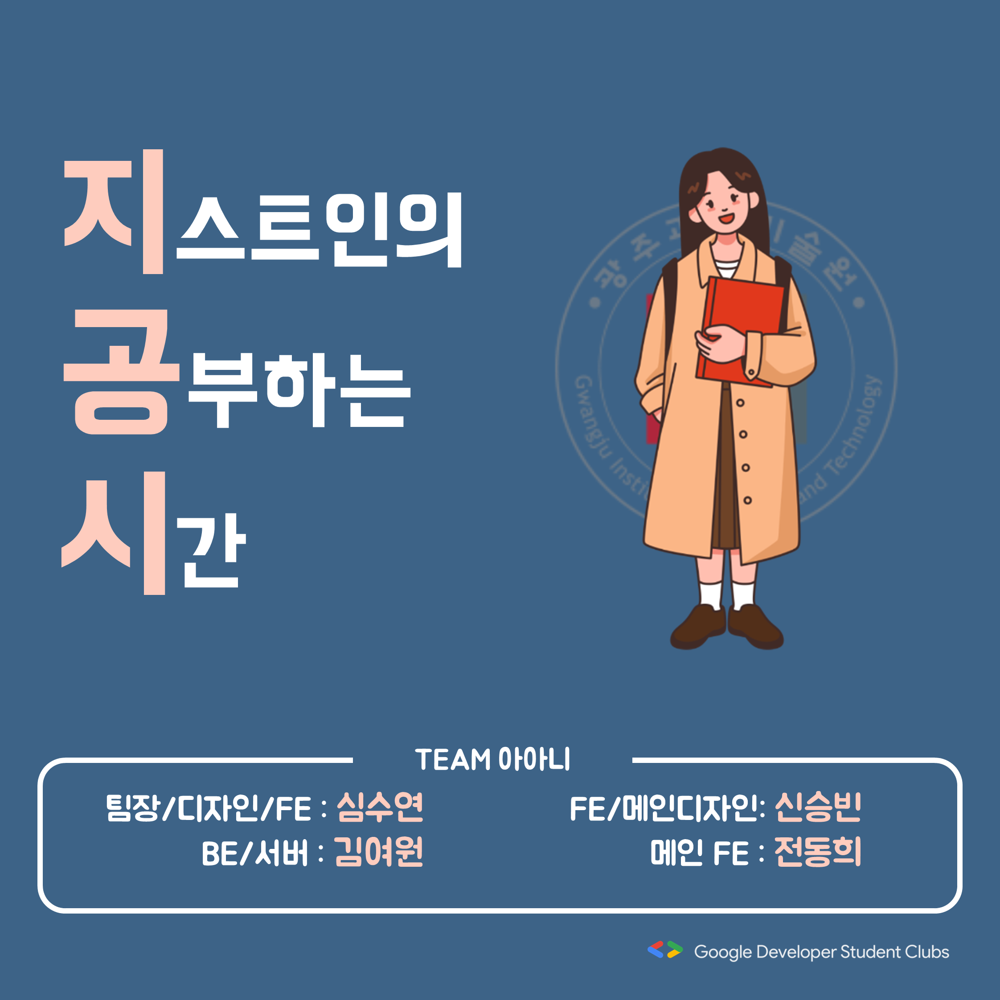
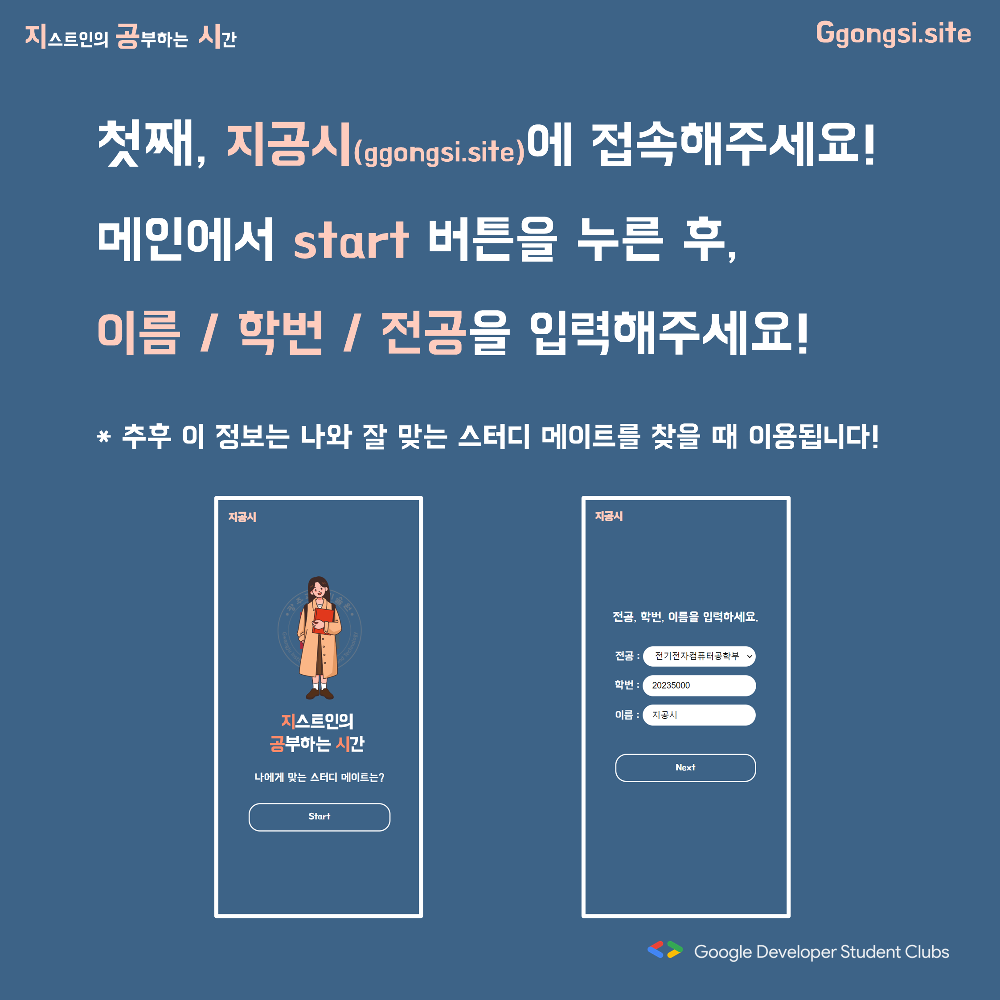
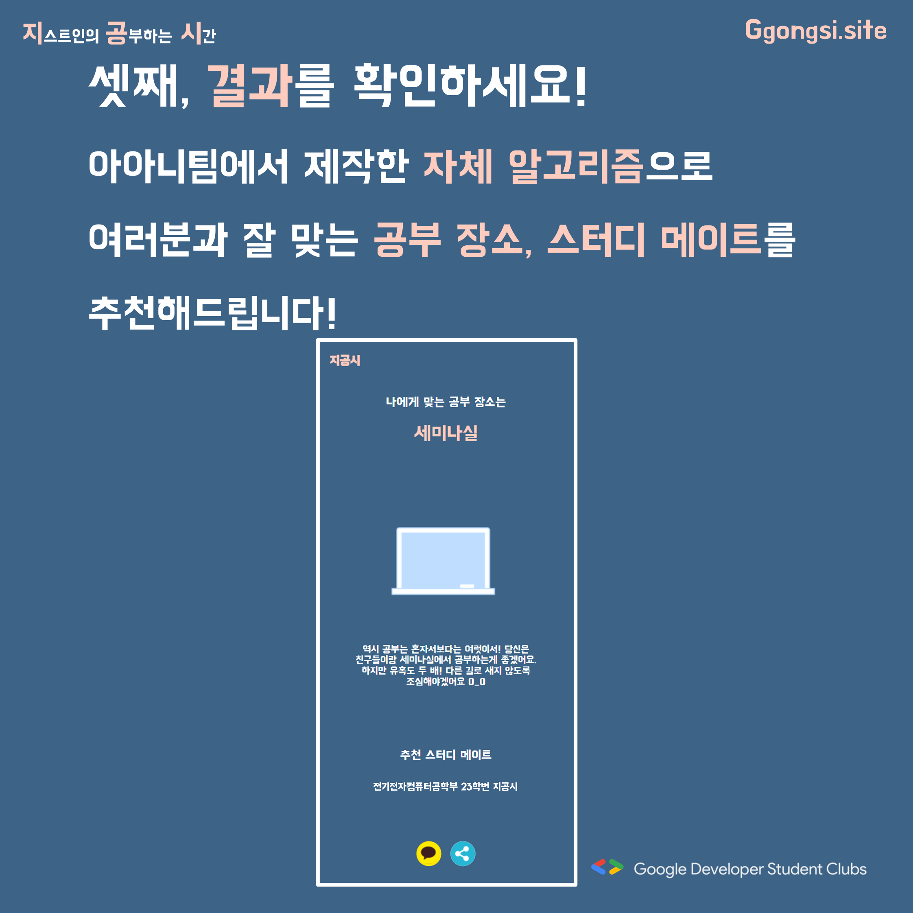
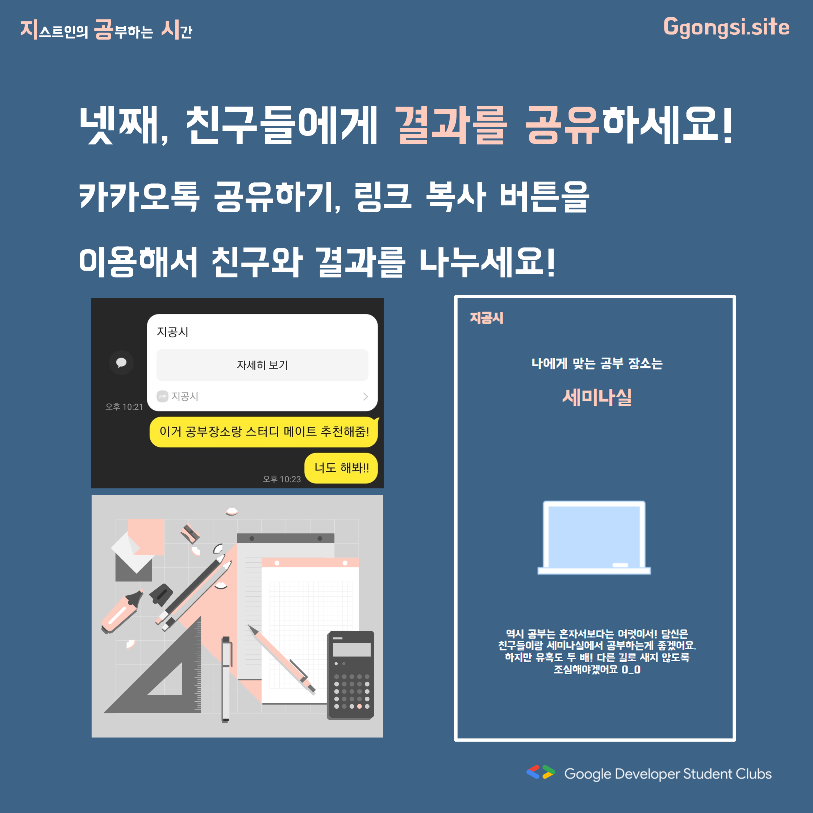
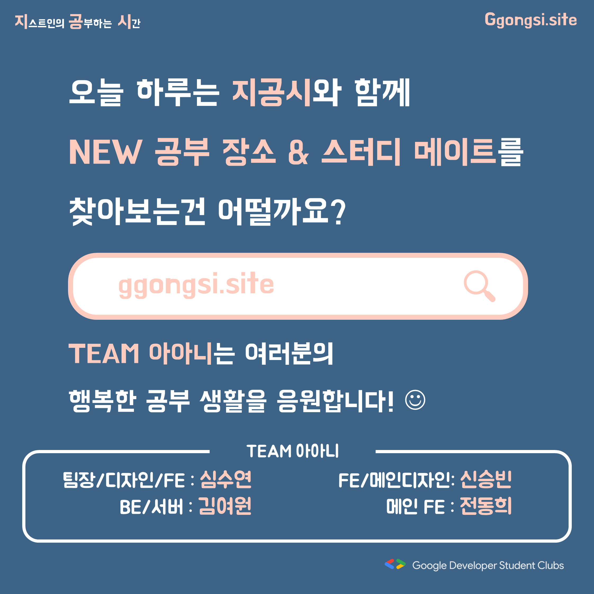

# 지공시 📚 당신의 공부장소&스터디메이트는?

 

### 1. 프로젝트 소개
>공부에 진심인 지스트인!  
나와 잘 맞는 공부 장소는 어디고, 스터디 메이트는 누굴까 매번 고민되시나요!  
그 고민을 **지공시**에서 해결해드립니다!  
간단한 7개의 문항 답변을 통해 당신의 결과를 확인하세요!  
 
 
 

### 2. 수행 방법

>#### 1 ) STEP1:  지공시 사이트(http://ggongsi.site) 에 접속해주세요!  
>>메인에서 start 버튼을 누른 후, 이름 / 학번 / 전공을 입력해주세요!  
>>###### *추후 이 정보는 나와 잘 맞는 스터디 메이트를 찾을 때 이용됩니다!*
  
 

>#### 2 ) STEP2: 일곱 개의 문항에 답변해주세요!
>>TEAM 아아니에서 공부 습관, 선호 장소 등을 알아볼 수 있는 질문을 준비했어요!
  
 

>#### 3 ) STEP3: 결과를 확인하세요!
>>TEAM 아아니에서 제작한 자체 알고리즘으로 여러분과 잘 맞는  
공부 장소, 스터디 메이트를 추천해드립니다!
  
 

>#### 4 ) STEP4: 친구들에게 결과를 공유하세요!
>>카카오톡 공유하기, 링크 복사버튼을 이용해서 친구와 결과를 나누세요!

 
 

### 3. 팀원 소개
> 안녕하세요, **TEAM 아아니**입니다!

>1. 심수연 : 팀장/디자인/FE
>2. 김여원 : BE/서버
>3. 신승빈 : FE/메인디자인
>4. 전동희 : 메인 FE
 

 
 

### 4. 기술 스택
> - deploy : AWS
> - BE : Django
> - FE : React
 
 

### 5. 공개 홍보 문구
[GDSC 프로젝트] 당신의 공부장소&스터디메이트는?  
 
공부에 진심인 지스트인!  
오늘은 어디서 공부할지, 누구와 공부할지 고민 중이신가요?  
그런분들을 위해 'TEAM 아아니'에서 '지공시' 프로젝트를 준비했습니다!  
 
이름 / 학번 / 전공을 입력 후, 7개의 간단한 문항 선택을 통해 결과를 확인하세요!  
TEAM 아아니의 자체 알고리즘을 통해 당신에게 딱 맞는 공부 장소와 스터디 메이트를 추천해드립니다!  
또, 검사 결과를 카톡 공유, 링크 복사 버튼을 통해 친구와 나눠보세요!  
 
📚📚  
http://ggongsi.site  
📚📚  
 
프로젝트의 더 자세한 내용은 여기에서!  
TEAM 아아니(심수연, 김여원, 신승빈, 전동희)  
https://github.com/GDSC-GIST/2nd_2023_Ggongsi

